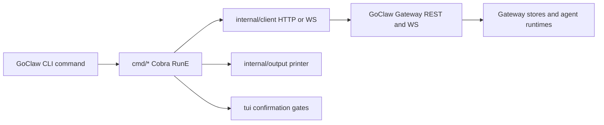

# Super Admin API Parity for GoClaw CLI

## Overview

Build the missing high-value command surface discovered after comparing `D:\www\nextlevelbuilder\goclaw-cli` with `D:\www\digitop\goclaw` at server commit `99460a7f`.

Goal: let super-admin agents use `goclaw` as the control plane for GoClaw Gateway operations, including coding-agent workstation management, package/runtime updates, secure credentials, webhooks, media/TTS, storage, and release upgrades.

Scope is intentionally route-parity driven. No speculative UX. Follow existing Cobra patterns, central error handling, output auto-detection, `--yes` safety gates, and file-size discipline.

## Scope Challenge

- Existing code: command groups already exist for agents, packages, credentials, MCP, TTS, media, storage, channels, tenants, logs, and docs. Reuse `newHTTP`, `newWS`, `buildBody`, `newMultipartWriter`, `tui.Confirm`, `output.NewTable`, and existing command split style.
- Minimum changes: fix one broken command contract, add commands for server routes that directly matter to super-admin/coding-agent ops, then update docs and tests. Defer OpenAI-compatible `/v1/chat/completions` and `/v1/responses` because `chat` already covers CLI agent interaction.
- Complexity: expected 10 to 16 command/test files touched. This is justified because each domain has separate command ownership and should stay under the 200-line guidance.
- Selected mode: HOLD SCOPE with `--deep --tdd`.

## Cross-Plan Dependencies

| Relationship | Plan | Reason |
|---|---|---|
| Blocks / supersedes | `260503-1907-domain-coverage-p3-plus` | Older gap plan is route-coverage oriented and now partly stale after server `v3.12.0-beta.5`; this plan narrows the next implementation to super-admin operational parity. |

## Architecture



Implementation principle:
- Prefer HTTP routes for CRUD and one-shot admin operations.
- Prefer WS only where server exposes WS-only behavior or long-running event streams.
- Keep commands thin. Put shared multipart/header helpers in existing helper files only when duplication becomes real.
- All command errors return upward. No local error printing.

## Phases

| Phase | Name | Status |
|-------|------|--------|
| 1 | [Contract Audit and TDD Harness](./phase-01-contract-audit-and-tdd-harness.md) | Complete |
| 2 | [Critical Ops Fixes](./phase-02-critical-ops-fixes.md) | Complete |
| 3 | [Workstations Command Surface](./phase-03-workstations-command-surface.md) | Complete |
| 4 | [Credential and Integration Surfaces](./phase-04-credential-and-integration-surfaces.md) | Complete |
| 5 | [Media TTS Storage Channel Fillers](./phase-05-media-tts-storage-channel-fillers.md) | Complete |
| 6 | [Docs Validation and Release Readiness](./phase-06-docs-validation-and-release-readiness.md) | Complete |

## Dependencies

- Server reference checkout: `D:\www\digitop\goclaw`, branch `dev`, commit `99460a7f`.
- CLI checkout: `D:\www\nextlevelbuilder\goclaw-cli`, branch `feat/ai-first-cli-expansion`.
- `docs/development-rules.md` is missing in this repo. Use `CLAUDE.md`, `README.md`, `docs/code-standards.md`, and `docs/codebase-summary.md` as the active standard set.
- Existing route gap evidence: [Scout Report](./reports/scout-report.md), [Endpoint Inventory](./research/server-endpoint-inventory.md), [Red Team Review](./reports/red-team-review.md).

## File Inventory

| File | Action | Rough size | Test impact |
|---|---:|---:|---|
| `cmd/api_keys.go` | Modify | small | Update revoke test to assert `POST /v1/api-keys/{id}/revoke`. |
| `cmd/api_keys_test.go` | Create | small | Contract test for revoke method/path and create/list smoke. |
| `cmd/gateway_upgrade.go` | Create | medium | Mock HTTP tests for status/start/header/tag validation. |
| `cmd/packages_updates.go` | Create | medium | Tests for list/refresh/apply/apply-all request bodies. |
| `cmd/workstations.go` | Create | medium | CRUD path tests and JSON/table shape tests. |
| `cmd/workstations_permissions.go` | Create | medium | Permissions/activity path and confirmation tests. |
| `cmd/webhooks.go` | Create | medium | CRUD/rotate/delete tests, secret-output handling. |
| `cmd/mcp_user_credentials.go` | Create or extend | small | GET/PUT/DELETE user credential tests. |
| `cmd/admin_credentials_grants.go` | Modify | small | `env reveal` confirmation and output-safety tests. |
| `cmd/admin_tts_media.go` | Modify/split | medium | Real media upload, TTS config/capabilities/synthesize tests. |
| `cmd/storage.go` | Modify/split | small | Upload/move request tests. |
| `cmd/channels_contacts.go`, `cmd/channels_writers.go` | Modify | small | Contacts unmerge, tenant-users, writer groups tests. |
| `README.md`, `docs/project-roadmap.md`, `docs/codebase-summary.md` | Modify | medium | Docs sync after implementation. |

## Test Scenario Matrix

| Priority | Scenario | Expected |
|---|---|---|
| Critical | `api-keys revoke` uses server route contract | Sends `POST /v1/api-keys/{id}/revoke`, not DELETE. |
| Critical | Gateway upgrade requires token and explicit tag | Sends `X-GoClaw-Upgrade-Token`, validates `latest` or release tag before request. |
| Critical | Workstations destructive operations | Refuse delete without `--yes`; use correct HTTP path when approved. |
| High | Package update apply-all partial result | Prints server payload without treating non-empty `failed` as local transport failure. |
| High | Credential env reveal | Requires confirmation; does not print secrets in table mode unless explicit flag. |
| High | Multipart media/storage upload | Streams file, sets content type, no full-file buffering. |
| Medium | Webhook rotate/create secret handling | JSON mode preserves payload; table mode warns show-once secret. |
| Medium | TTS synthesize binary/audio response | Supports `--output-file`, avoids corrupting JSON output. |

## Dependency Map

- Phase 1 blocks all implementation. It creates contract tests and route inventory.
- Phase 2 should land before later phases because it fixes known broken behavior and adds runtime upgrade/package update flows.
- Phase 3 can run after Phase 1 and does not depend on Phase 2 code.
- Phase 4 depends on Phase 1. It touches sensitive credential paths and must be reviewed before docs claim parity.
- Phase 5 depends on shared multipart patterns from existing vault/team workspace code.
- Phase 6 depends on Phases 2-5 passing focused tests.

## Red Team Review

Adjudicated report: [Red Team Review](./reports/red-team-review.md)

Accepted findings now harden the plan:
- Gateway upgrade must test custom header injection and env-token fallback.
- Package `apply-all` must not silently exit 0 on non-empty `failed[]` unless `--allow-partial` is explicit.
- Workstation link/unlink must use verified WS methods and exact `agentId` / `workstationId` params.
- `env:reveal` must require explicit reveal gates and avoid table-mode secret dumps.
- TTS synthesize must write raw audio to file, not structured stdout.
- README must revise "Full API coverage" if any endpoint remains deferred.

## Implementation Summary

Completed on 2026-05-18:
- Fixed API key revoke contract and added focused route tests.
- Added `system upgrade`, package update lifecycle, workstations, webhooks, MCP user credentials, env reveal, media upload, TTS config/capabilities/synthesize, storage upload/move, contacts unmerge, tenant users, and writer groups.
- Hardened raw HTTP error mapping and automation output after code review.
- Validation passed: `go test -count=1 ./...`, `go vet ./...`, `go build ./...`.

## Success Criteria

- `go build ./...`, `go vet ./...`, and focused `go test ./cmd/... ./internal/client/... ./internal/output/...` pass.
- New or changed commands have table and JSON/YAML-safe output.
- Destructive or secret-revealing commands require `--yes` or explicit reveal flags.
- README command inventory matches implemented command tree.
- Route gap report shows all P0/P1 super-admin gaps either implemented or explicitly deferred.

## Cook Handoff

```powershell
ck cook D:\www\nextlevelbuilder\goclaw-cli\plans\260518-1936-super-admin-api-parity\plan.md --tdd
```

## Not In Scope

- Implementing new server endpoints in `D:\www\digitop\goclaw`.
- Replacing existing chat command with OpenAI-compatible `/v1/chat/completions`.
- Browser UI work.
- Release publishing or PR creation.

## Unresolved Questions

- None blocking. For `gateway upgrade`, implementation should default to `--upgrade-token` plus `GOCLAW_UPGRADE_TRIGGER_TOKEN` env fallback unless user requests another auth pattern.
